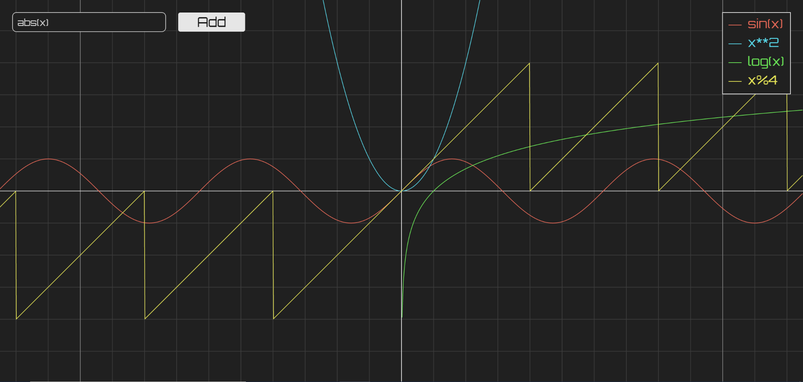

# js-taylor_visualization
This is a proyect on showing a visualization of taylors algorithm I built using <a href="https://p5js.org/">p5.js</a>.
## URL
This proyect is hosted by github pages at <a href="https://pabloqb2000.github.io/js-taylor_visualization/">this link</a>.
## Options
The interpolated function can be changed with a text box.  
The maximum degree of the polynomial can be changed with a slider.  
The node of interpolation can be changed with a draggable dot.
## Screenshot
</img>
## References
To find more information about the <b>awesome</b> library used for this proyect visit:
<a href="https://p5js.org/"> https://p5js.org/ </a>

## Other proyects
Checkout my other proyects at <a href="https://pabloqb2000.github.io/Click_math/">Click math</a>
